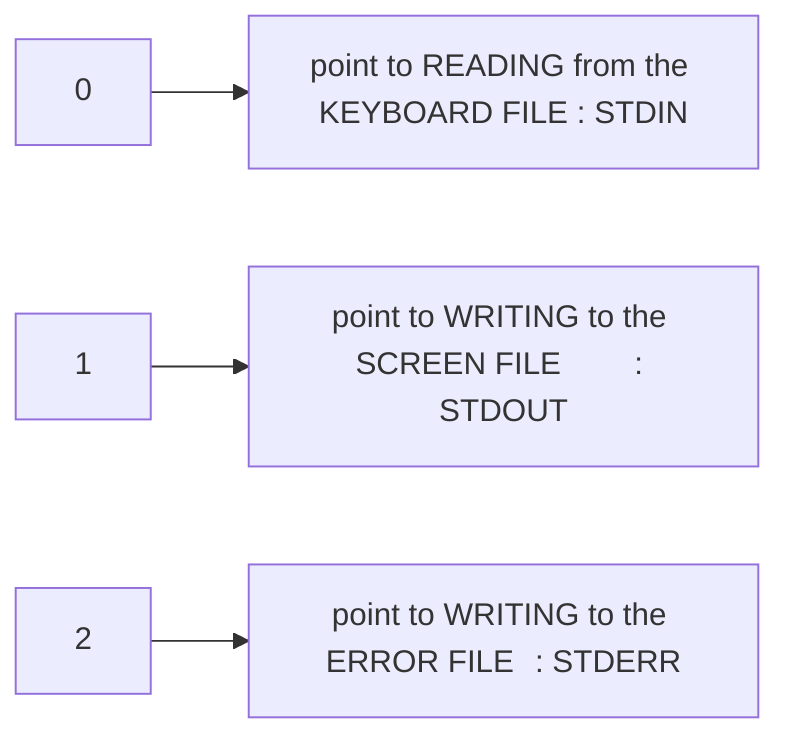
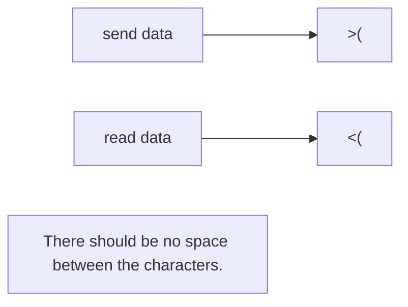
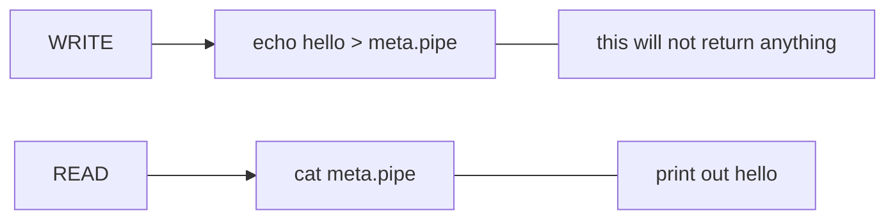

## LINUX LEECH


### __cat__


| Command | Description |
| -------- | -------- |
**cat file1.txt > file2.txt** 	| override the current content of file2.txt
**cat file1.txt >> file2.txt**	| append to the current content of file2.txt
**cat > file1.txt CTRL + D** 	| write directly into a file

...

### __dir__
| Command | Description |
| -------- | -------- |
**mkdir --parents** 				| mkdir -p
**mkdir -p dire1/dire2/dire3/{dire4, dire4}** 	| create an entire file tree and put two files at the end.

...

### __ls__
| Command | Description |
| -------- | -------- |
**ls --all**	| ls -a
**ls -l**       | List elements of a directory with their permission, size information and more. 
**ls -la**  	| combination of -a and -l, the order doesn't matter: al = la
**ls -R** 		| recursive display of directories and their contents.
**ls -R dir1**	| targeted at a directory and elements in it.

...

### __cp__
| Command | Description |
| -------- | -------- |
**cp file1.txt file2.txt**
**cp file1.txt dir2** 		| copy a file and put it in a directory
**cp file1.txt file2.txt dir2**	| copy the files to the directory but remove existing file of the same name.
**cp -i file1.txt file2.txt dir2**	| copy to the directory but warn if a file of the same name already exits.
**cp ../file1.txt ../file2.txt .** 	| copy to current directory.
**cp -R dir1 dir2**		 	| copy a directory that has contents to another directory

...

### __rmdir & rm__
| Command | Description |
| -------- | -------- |
**rmdir -p q/e/t/y** 	| remove empty directory structure starting from the last directory
**rm -r dir2** 		| remove directory, directory structure - empty or not

...

### __mv__
| Command | Description |
| -------- | -------- |
**mv file1.txt file2.txt** 		| rename file1.txt to file2.txt -> overwrite if file name already exists.
**mv file1.txt dire1** 		| move file1.txt to dire1 -> overwrite
**mv -i file1.txt file2.txt dir2** 	| warn if file name already exists.

...

### __less__
**same as "cat" and "more" but with more functionality.**

| Command | Description |
| -------- | -------- |
**/pattern** 	| search downward for a pattern in the file starting at the current location.
**?pattern** 	| same as / but search upward through the document.
**space key** 	| scroll down faster, a page at a time.
**B** 		| scroll up faster, a page at a time.
**shift + G** 	| jump to the end of the documents
**1 + G** 		| jump to the beginning of the doc.
**q**		| exit

...

### __head__
| Command | Description |
| -------- | -------- |
**head** file.txt | print the first 10 lines of the document.
**head -n [number]** file.txt	| print "number" lines of the documents starting at the top.
**head -n [-number]** file.txt 	| print everything except for the last "number" lines.
**head -c [number]** file.txt 	| print "number" of bytes including newline characters (\n).
**head -v** file.txt 		| verbose=[-v] print a header before the data. quite=[-q], its opposite.

**head -q = head**

...

### __sort__
| Command | Description |
| -------- | -------- |
**sort** file.txt 			| sort the file in ascending order using the first character.
**sort -n** file.txt 		| sort numeric value in ascending order.

| sort options | Description |
| -------- | -------- |
**[-R]** | randomoze the file  
**[-f]** | ignore case 
**[-r]** | reverse 
**[-o]** | output result

**sort file1.txt file2.txt -o file3.txt**
OR
**sort file1.txt file2.txt > file3.txt**

**if sort doesn't work, change the local variable: LC_ALL=C**
```shell
~$ export LC_ALL=C 
```
...
	
### __file__
| Command | Description |
| -------- | -------- |
**file** filename.extension 	| detect the type of the file
**file** filename 			| still can detect the type of the file even without extension 

...

### __White space__
if a directory of a file has a white space in its name, it can become difficult to 
refer to it in the command prompt. The method to deal with that is to use the backward slash (\)

cd wild\ cards : this will change the current directory to /wild cards

...

### __wild card__
| Command | Description |
| -------- | -------- |
**?** 	| represent only one characters
`*` 	| represent multiple or no characters.
**!** 	| not or opposite of
**[]** 	| use characters for regex lookup or matching. ie [ab] -> anything that contains [a] or [b].
**alpha** 	| alphabetic character
**digit**	| numberic character
**alnum**	| alphanumberic character
**lower** 	| lower case character
**uppper**	| upper case character

ls pic?.jpg
ls *.jpg
ls [[:upper:]]*
ls [[:alpha:]][[:alpha:]].doc
ls [![:alpha:]]* 	: lists all files that don't start with an alphabetic character.

...

### __pipe__
| Notation | Description |
| -------- | -------- |
\| | take the ouput of a command and use it as input of another.

```bash
ls -lt | head
history | less
find . -type f -print | head | wc -l
find . -type f -print | wc -l > file.txt
```

...

### __uniq__
| Command | Description |
| -------- | -------- |
**uniq** file1.txt 			| remove all but one of SUCCESSIVE repeated lines.

| uniq options | Description |
| -------- | -------- |
**[-c]** 				| count the occurences SUCCESSIVE repeated lines.
**[-d]** 				| only display repeated lines.
**[-u]** 				| lines that are not repeated.

```bash
# put every repeated lines in SUCCESSIVE order and count.
sort file1.txt | uniq -c 	 

# display repeated lines and count their occurences.
uniq file1.txt -dc 		
```

...

### __command substitution__

__backticks__
```bash
# print the name of txt files that contain word "WordSearch".
grep -l "WordSearch" *.txt 		 

# use output of grep as input of gedit.
gedit `grep -l "WordSearch" *.txt`
```
##### **If using nested backtick use escape character inside backtick (\\\`).**
```bash
ping -c $((2 * `cat \` grep -l "demotext" *.txt \` | wc -l`)) www.google.co.uk
```
	
**dollar sign**
```bash
gedit $(grep -l "WordSearch" *.txt)
ping -c $((2 * $(cat $(grep -l "wordSearch" *.txt) | wc -l))) www.google.co.uk
```

...

### __alias__
```bash
# system checks the alias list before the command list when typing a command
alias hello='echo Hello world'
alias ping='ping -c 5'

unalias ping
```
**alias** allows to create new command by sustituting a string in place of a command.

...

### __tty__
**tty** prints out the location of character's special file associated with the current terminal.
Each ternimal has a different value tty location.

```bash
# we send the output of echo to terminal whose special character is 2
echo hello > dev/pts/2 	

# show all running terminal
who 	#not sure that's true. Check that!!!		
```
...

```bash
ssh localhost
who
ping -c6 www.google.co.uk > dev/pts/[ssh terminal code]
```
**cat**

Type these command to create a chat between two terminal 

```bash
cat > /dev/pts/[terminal_1_number]
cat > /dev/pts/[terminal_2_number]
```

### __separatator__

**\ + ENTER key** allow to enter multiple command on different lines by escaping the Enter key.
**Warning:** need to escape the apostrophe as the bash sees is as a special character. (\\\')

```shell
echo we are here to see Paul\'s accomplisments\
> and his new house.

echo hello word | w \
> -c
```

### __BACKGROUND JOB__

**&** make a process run on the BACKGROUND (bc) instead of the FULLGROUNG (fg).
```bash
# echo one will be a background JOB.
echo one & echo two
```
### __SUB-SHELL__

**()** a sub-shell is **FORKED** to execute the command in parentheses.  
**$BASHPID** variable showing the current process id of a current shell.

**Parent-Child Bash ID**  
```bash
echo $BASHPID; (echo Inner pid: $BASHPID) # the PID's will be different.
```

**Parent-Child-GrandChild** 
```bash
echo $BASHPID; (echo Outer pid: echo $BASHPID; (echo Inner pid: $BASHPID)) 
```

...

### __FILE HANDLE__
File Handle or File Descriptor is an Abstract Representation Of a File.


```bash
echo hello 1> bar.txt
```
**acho** wrong command, hence producing an error
```bash
# redirect the error to error.txt
acho bar.txt 2> error.txt  	
```
```bash
# std.py print out to both STDOUT and STDERR
# Redirect STDOUT to both.txt. Then, STDERR to STDOUT ($1 = both.txt)
./std.py 1> both.txt 2>$1  	 

# redirect both.txt to STDIN
cat 0< both.txt  # "0<" == "<"

```
**Manupilate File descriptors with exec**
#### Open writefile as file descriptor 4 for writing
```bash
exec 4> writefile
```
#### Open readfile as file descriptor 3 for reading
```bash
exec 3< readfile
```

#### Make file descriptor 5 a copy of file descriptor 0
```bash
exec 5<&0
```

#### Close file descriptor 3
```bash
exec 3<&-
```
...

### __FILE SUBSTITION__
**File Substitution is about refering to the ouptut of a command as a file.**


```bash
# output seq-output-path
echo <(seq 10)

# output numbers from 1 to 10
echo $(seq 10)

wc -l <(seq 10)

# wc -l 1 2 3 4 5 6 7 8 9 10 : This gives an error as wc expects a file.
wc -l $(seq 10)  
```
```bash
# variable holding bash process ID.
$BASHPID 		

# return a number | 0: not in subshell | n: in nth subshell
$BASH_SUBSHELL 

echo $BASH_SUBSHELL
(echo $BASH_SUBSHELL)

# print shell path : dev/pts/[number]
echo <(echo $BASHPID) 			
```

**pr** prints content of FILES side by side.
```bash
pr -mt <(ls -1v dir1) <(ls -1v dir2)
```

**md5sum** create a hash of a given input.
```bash
# This will create hash.md5 file.
# Send data to the command in parenthesis like a pipe.
echo hello > >(md5sum > hash.md5)
```
...

### __Name Pipe__
just like a **unmamed pipe (|)**, **name pipe** also allows inter-process communication.

**mkfifo** make first-in-first-out
```bash
# create a file of type fifo pipe.
mkfifo medal.pipe 		: 

# [mode bits] set to read write : this is optional.
mkfifo -m a=rw metal2.pipe 	
```

**To use a pipe, use two terminal	: Both side must be connected.**


```bash
PS=">"
> for i in `seq(10)`; do echo $i; sleep 1; done > metal.pipe &

# CLOSE AFTER READING
> cat metal.pipe 	

# READ and WRITE (<>) keep the pipe OPEN (CONNECTED ON BOTH SIDE) and WAIT for DATA.
> cat <> metal.pipe 

```

##### __THEN OPEN NEW SHELL__
```bash
for i in `seq 10 20`; echo $i; sleep 1; done > metal.pipe &
```

##### __We can have mutliple process reading (cat <> meto.pipe) and writing (for i ...) to the pipe.__

##### __Keep the pipe open and wait until we explicitely exit(Ctrl+c)__
```bash
cat <> 	
```
##### __Close After Reading__
```bash
cat pipleName
```
...

### __Tee__
**Tee** allow to redirect the output of a pipe (|) without interrupting its flow to other processes.

```bash
# wc input comes from [sort ..] not [tee ...]
sort list.txt | tee sortedList.txt | wc -l 

# tee can write to muutiple file.
sort file1.txt | tee file2.txt file3.txt file4.txt ... | wc -l 
```


| Tee option | Description | 
| -------- | -------- |
**tee**    | OVERWRITE 
**tee -a** | APPEND

```bash
# "uniq" executs after "tee".
sort list.txt | tee >(uniq > fruits.txt) | wc -l

# compare/display both files at the same time
pr -mt list.txt fruits.txt		
```

```bash
# compare both files content.
wget -0 - www.google.co.uk | tee >(md5sum > file1.md5q) >(sha1sum > file1.sha) >(sha512sum > file1.sha512) > google.txt

cat google.txt | md5sum -c file1.md5
```
...

### __Random__
```bash
# produce Pseudo Random numbers from 0 - 32,767
$RANDOM

# change to the seed of Random number generator to n.
RANDOM=n 
```
```bash
echo $RANDOM
echo $((RANDOM % n))
echo $((1 + RANDOM % n))
```
```bash
echo $( NUMBER=0; FLOOR=1000; RANGE=1500;\
> while [$NUMBER -le $FLOOR]; do \
> NUMBER=$RANDOM; \
> let "NUMBER %= $RANGE"; \
> done; \
> echo $NUMBER;)
```
...

### __NO HANGUP IMMUNE__
**Two type of Jobs** Foreground (FG) and Background (BG)

| Keys AND Notation | Description | 
| -------- | -------- |
**&** | RUN A JOB IN BG
**CTRL + C** kill a job      | only works on FG jobs
**CTRL + Z** supsend a job   | only works on FG jobs


**fg** if the shell is being polluted by the output of a **BG job**, you can't stop it using **CRTL + Z or C**.
	The only option is to type **"fg"** on the shell to make the **Job FG**, then Kill or Suspend or let it run.

**To avoid output pollution by a BG job, redirect its output.**
```bash
./count.py > /dev/null &
```

| Job command | Description | 
| -------- | -------- |
**jobs** 			| output -> [job_number][sign] [job_state] -> +: current job
**jobs -l** 		| list jobs with their PIDs 

| Kill command | Description | 
| -------- | -------- |
**kill %job_number** 	| kill a job
**kill -stop %job_number**	| stop a job, same as **CTRL + Z**

| fg/bg command | Description | 
| -------- | -------- |
**bg %job_number** 		| Resume a job
**fg %job_number**		| Foreground a job

**If we close the terminal all the jobs stop and cannot be recovered.**
	
### __nohup__
**nohup**  redirect **STDERR** and **STDOUT** ouputs to a file in the RUNNING directory.
	if the Present-Work-Wirectory denies access, it redirects ouputs to HOME directory referenced to by **$HOME**.
	The file the output is stored to is typically call "nohup.out"

```bash
# redirect the output to "file_name" instead of "nohup.out"
nohup ./count.py & > file_name

# doesn't output on the STDOUT and runs on BG after ternimal closes.
nohup ./count.py & 		: 
```

### __input__
let stopOnRead.py a code that print ("Running") request user input ("Enter some input: ")

##### __The code will print ("Enter some input: "), then stop__
```bash
./stopOnRead.py &
```
##### __BG jobs can't take input so change it to FG.__
```bash
fg %job_number 
```

### __nohup notes__
If a program tries to read from **STDIN**, NOHUNG UP terminates it.

**A Work around is to enter an input in the terminal.**

##### __Only work if the program requests a single input.__
```bash
nohup echo hello | ./stopOnRead.py & 
```
##### __Solve the input problem, if the program continuously asks for input.__
```bash
(yes hello | nohup ./stopOnRead.py) &
```
### __redirect input__ 

##### __Create a pipe to redirect STDIN to it and prevent "nohup" termination.__
```bash
mkfifo program.pipe 
```
##### __At this stage the pipe is blocking the program until it receives inputs.__
```bash
nohup ./stopOnRead.py < program.pipe & 
```

TO PREVENT THAT WE NEED TO OPEN A SECOND - PERMANENT - CONNECTION TO THE PIPE THAT ONLY WRITE.

let pipestint.py and progam that open a constant **WRITE** - not **READ** - connection to the pipe.

##### __changes the program mode so it runs - may be optinal if done in the past.__

```bash
chmod u+x pipestint.py 
```
##### __This program will never stop, so keep the process_id or write it in the same file as the "nohup" output.__
```bash
./pipestint.py &
nohup ./stopOnRead.py < program.pipe &
```

**NOTE:** You might want to consider using nohup on pipestint.py, so it doesn't stop when the shell closes. 

##### __See the kind of input the program needs by checking its ouput__
```bash
cat nohup.out
```
```bash
echo hello > program.pipe
```
##### __Check the ouput again__
```bash
cat nohup.out
```
##### __Sent the last input request__
```bash
echo second > program.pipe
```

**NOTE:** we could also use the command -> [cat > program.pipe &] instead of the pipestint.py script.
**NOTE:** NOHUP STOPS THE PROCESS ON INPUT REQUEST BECAUSE IT INTERNALLY REDIRECT IT STDIN TO AN UNREADABLE FILE.
THE SMALLER THAN SIGN "<" IS SET TO "0<" BY DEFAULT.	

...

### __Cut__

**Cut** allow to remove section of text from a line or select characters from a line

```bash
# [-b] byte(8 bites)
echo I like lamp | cut -b 1
# output : I
```
```bash
# [-b] byte(8 bites)
echo I like lamp | cut -b 1,6
# output : Ie
```
```bash
for i in $(seq 10); 
do echo $(seq -s ' ' 1 9) >> numbers.txt; done
```

```bash
# [d ' '] delimiter | [-f number] number of the field to extract.
cut -d ' ' -f 2 numbers.txt : 
```
| cut options | Description | 
| -------- | -------- |
**[-f -n]** 	 	   		| everything up to n
**[-f n-]** 		   		| everything after n  (inclusive)
**[-f n1-n2]** 	   			| everything between n1 and n2 (inclusive)
**[-f n1, n2, n3, n4]** 			| only n1, n2, n3, and n4
**[-- output-delimiter "enter_delimiter"]** | changes the delimiter of the output. The delimiter can be a long string/anything.

```bash
# The code execute from left to right	
grep job < file.txt | wc -l | awk '{print "There is " $1 " jobs"}'
```

* **Step 1-a:** The process search for the occurance of "job" inside the folder.
* **Step 1-b:** If found, an ouput is created containing line lines where the word "job" was found.
* **Step 2  :** The output is passed to the process wc -l [word count line] an return the number of lines of its input/grep-ouput.
* **Step 3  :** The value returned is passed into the awk process. $1: capture the first word of the input/wc-output.

**The result depends and the number of lines inside file.txt that contains the word "job".** 