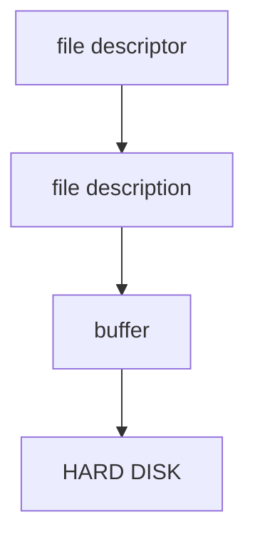
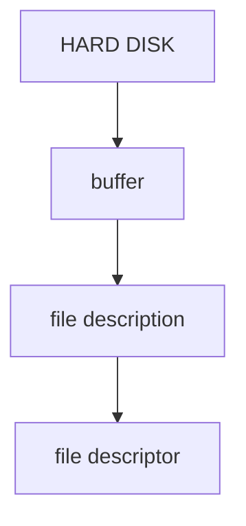

### __Terminal and Pseudo-terminal files__

| Terminal file | Description |
| -------- | -------- |
**/dev/pts** |  directory of PSEUDO TERMINAL SLAVES
**/dev/tty** | constrolling terminal file
**/dev/tty[n]** | 'virtual console' terminal files
 
...

### __Conditional Execution__
| Condtions | Description |
| -------- | -------- |
**programA && programB** | programB runs if programA returns 0 (success)
**programA `\|\|` programB** | programB runs if programA returns 1 or other (failed)

```shell
name=value
echo $name
echo ${name}Ali
```

### Difference between single quote (') and double quote ("")

| Column 1 | Column 2 |
| -------- | -------- |
**echo '$name'** | $name
**echo "$name"** | value

...

### __Environment variable__
```shell
varName = value1
export varName
varName=value2
```
...

### __LOOP AND CONDITION__
```bash
if command-list then command-list fi
while command-list do command-list done
```

**command-list: any command that returns 0 (successful) or 1 (failed)**

...

### __FUNCTION__

**function name {command-list}**

```bash
# invoke ls then cd
function foo 
{
    ls -la;
    cd /;
} 
foo	# ls -la and cd / --> results
```
__We don't nee the semi column at the end of each command__
__However, separate commands by a new line__
```bash
function foo
{
    ls -la
    cd /
}
```

### __FUNCTION WITH ARGUMENT__
```bash
function foo {cd $2; ls $1}

foo /bin /home
```
...

### __FUNCTION RETURN VALUE__
```bash
function foo {return 3}

foo
echo $? # 3
```

### __BRACE EXPENSION__
```bash
foo{apple, banana}bar
# fooapplebar foobananabar

```
...


### __ARITHMETIC SUBSTITUTION__
```bash
$((expression))

$((5 + 8))

foo=4
$((5 + $foo))
```

### __WILD CARDS__
| Wild cards | Description |
| -------- | -------- |
`*` | match any characters
? | match any single character

...

### __SUB SHELL__
```bash
# execute in a subshell
(command-list)  
```

### __GROUP REDIRECTION__

**{/n command-list \n}**

```bash
commandA > { ls -la; cd }
commandA | { ls -la; cd }
```

...

### __SOURCE COMMAND vs ./__

__FIRST METHOD: IN CURRENT SHELL__

**source file : execute file in the current shell**
```bash
source ./bashrc [rc means -> run command]
```


__SECOND METHOD: IN SUBSHELL__
```bash
#use the bash executable to run foo.sh
/bin/bash foo.sh	
```
**SHORT CUT --> ADD bash executable path in the fisrt line of the foo.sh file**
```bash
#!/bin/bash
```
```
./             : expends to /home/ubuntu/
./foo.sh	: /bin/bash ./foo.sh --> runs in a subshell
```

##### NOTE: BUILT-IN SHELL PROCESS RUNS IN THE CURRENT SHELL NOT A SUB-SHELL. 
##### SUBSHELL ARE COMMONLY USED ON PROGRAM RUNNING IN THE BG.

```bash
foo & fizz; fizz; buzz &

# run command in subshell and in bg
{ cd/; ls -la } & or (cd/; ls-la) & 
```

### __Change permission__

```bash
# give file own by user u, execution permission +x 
chmode u+x
```
...

### __READ/WRITE ON FILE__
##### READ AND WRITE ARE NOT ATOMIC. SO, IF MULTIPLE FILE MANUPULATION ARE DONE AT THE SAME TIME, THE RESULT MAY BE UNPREDECTIBLE.

## __WRITE__

...

## __READ__

**A file description can have many open file descriptors.**

...

### __DEVICE FILES__
| Device file type | Description |
| -------- | -------- |
**Block device file**| Mostly storage devices which are divided into partition, and	partition are divided into BLOCKS.
**Character device file**| write goes to input buffer, Read goes to ouput buffer. The device its input and sends output to its respective buffers.

...

### __PSEUDO DEVICE__
| File path | Description |
| -------- | -------- |
**/dev/zero** | returns zeroes bytes
**/dev/randon**| retuns random data
**/dev/null**| discards data; returns no bytes at all


**NOTE: ADD SPACE BEFORE A COMMAND TO NOT HAVE IT SAVED IN THE HISTORY.
NOTE: TYPE CTRL+X+E TO OPEN AN EDITOR WRITE A CODE AND EXECUTE AT EXIT.
NOTE: TYPE 'FC' TO OPEN LAST COMMAND IN AN EDITOR AND EXECUTE AT EXIT.**


